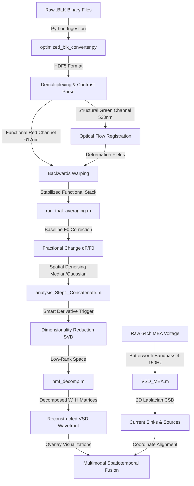

# Signal Processing Pipeline for Multimodal VSDI and MEA Fusion

An end-to-end computational pipeline designed to ingest, pre-process, stabilize, decompose, and integrate simultaneous Voltage-Sensitive Dye Imaging (VSDI) and Multielectrode Array (MEA) recordings. This framework bridges macroscopic cortical subthreshold dendritic dynamics (superficial layer 2/3 inputs) with localized extracellular spiking and local field potentials (deep-layer outputs).



---

## Academic Summary & Core Problem

In vivo optical imaging of transmembrane potentials offers unprecedented access to subthreshold cortical dynamics. However, raw Voltage-Sensitive Dye (VSD) recordings are heavily corrupted by physiological noise (cardiac-induced brain pulsation, respiratory motion) and photobleaching illumination drifts. These artifacts share spectral space with the true neural depolarization signal, rendering them inseparable by simple temporal filtering. 

This computational pipeline addresses these challenges via:
1. **Cross-Channel Variational Optical Flow**: Exploits time-multiplexed dual-wavelength illumination (structural green vs. functional red channels) to stabilize non-rigid tissue movement at sub-pixel accuracy without signal suppression.
2. **Polarity-Safe Source Separation**: Replaces standard Independent Component Analysis (ICA) with Non-Negative Matrix Factorization (NMF) to isolate physiological activation from camera read noise and heartbeat artifacts without polarity (sign) ambiguity.
3. **Current Source Density (CSD) Fusion**: Synchronizes 2D Current Source Density maps from deep cortical layers with baseline-corrected superficial VSD "optical dipoles" to study input-output mapping.

---

## Mathematical Formulation

### 1. Signal Extraction & Normalization
The functional neural signal is isolated as the fractional change in fluorescence over time:

$$\frac{\Delta F}{F_0} = \frac{F(t) - F_0}{F_0}$$

where $F(t)$ is the motion-compensated fluorescence intensity, and $F_0$ is the resting-state baseline fluorescence computed over a pre-stimulus temporal window.

### 2. Singular Value Decomposition (SVD) Denoising
Prior to matrix factorization, the high-dimensional flattened spatiotemporal VSD matrix $X \in \mathbb{R}^{M \times N}$ (where $M$ is the binned pixel space and $N$ is the concatenated timeframe space) is projected into a lower-dimensional subspace:

$$X = U \Sigma V^T$$

where $U$ contains the spatial singular vectors, $V$ contains the temporal singular vectors, and $\Sigma$ contains the singular values. Retaining only the leading principal components (PCs) effectively discards high-frequency sensor shot noise.

### 3. Non-Negative Matrix Factorization (NMF)
To resolve the polarity (sign) ambiguity of ICA, NMF factorizes the non-negative baseline-shifted spatiotemporal matrix $X \ge 0$ into spatial weights $W$ and temporal activations $H$:

$$X \approx W H \quad \text{s.t.} \quad W \ge 0, H \ge 0$$

By algebraically enforcing non-negativity, NMF guarantees that the extracted components represent physically plausible, additive neural depolarizations rather than inverted spatial deflections.

### 4. 2D Current Source Density (CSD)
CSD profiles are estimated from extracellular local field potentials (LFPs) across the 2D Multielectrode Array using a discrete Laplacian estimator:

$$\text{CSD}(x, y) \approx -\sigma_c \left( \frac{V(x+dx, y) - 2V(x, y) + V(x-dx, y)}{dx^2} + \frac{V(x, y+dy) - 2V(x, y) + V(x, y-dy)}{dy^2} \right)$$

where $V(x, y)$ is the interpolated potential at grid coordinates, $\sigma_c$ is the tissue conductivity, and $dx, dy$ represent the physical electrode pitch.

### 5. Bipolar Optical Dipole Synthesis
To correlate the AC-coupled electrophysiological measurements with the unipolar optical fluorescence, a differential optical dipole is synthesized:

$$\text{Optical Dipole}(t) = \text{ROI}_{\text{active}}(t) - \text{ROI}_{\text{reference}}(t)$$

Subtracting a distant reference region of interest (ROI) removes common-mode background decay, global illumination fluctuations, and respiration artifacts, isolating the localized cortical transient.

---

## Validation Metrics & Performance

* **Motion Correction Fidelity**: The maximum peak displacement of $7.19 \text{ px}$ in raw files is reduced to a sub-pixel residual mean of $0.5408 \pm 0.0898 \text{ px}$ post-registration, validated by a **$74.52\%$ reduction in Laplacian spatial variance** with no artificial signal suppression.
* **Component Extraction Accuracy**: NMF decomposition on binned VSD sweeps explains **$99.31\%$ of global variance** across 8 components, yielding a reconstructed signal-to-noise ratio (**SNR) of $15.31\text{ dB}$**.
* **Multimodal Correlation**: Cross-correlation confirms that localized Current Source Density sinks are temporally aligned with the rising edge of the synthesized VSD optical dipole (somatosensory evoked potential onset at $\approx 14.16\text{ ms}$).

---

## Repository Directory Map

### 1. Ingestion & Pre-processing (Python)
* [optimized_blk_converter.py](file:///c:/Roy/Code/vsdi/vsdi-pipeline/python/ingestion/optimized_blk_converter.py) / [blk_batch_converter.py](file:///c:/Roy/Code/vsdi/vsdi-pipeline/python/ingestion/blk_batch_converter.py): High-performance, memory-mapped batch converters translating proprietary `.BLK` binary movies to chunked, compressed HDF5 (`.h5`) formats.
* [blk_log_parser.py](file:///c:/Roy/Code/vsdi/vsdi-pipeline/python/ingestion/blk_log_parser.py): Ingests acquisition logs and extracts structured JSON trial metadata (FPS, stimulus parameters).
* [batch_demux_1000.py](file:///c:/Roy/Code/vsdi/vsdi-pipeline/python/preprocessing/batch_demux_1000.py): Interleaves dual-illumination structural and functional frames based on contrast thresholds.
* [video_stitcher.py](file:///c:/Roy/Code/vsdi/vsdi-pipeline/python/visualization/video_stitcher.py) / [raw_vs_motion_visualization.py](file:///c:/Roy/Code/vsdi/vsdi-pipeline/python/visualization/raw_vs_motion_visualization.py): Generates comparison diagnostic clips comparing raw and registered movies side-by-side.

### 2. Core Signal Processing (MATLAB)
* [vsd_motion_correct.m](file:///c:/Roy/Code/vsdi/vsdi-pipeline/matlab/motion_correction/vsd_motion_correct.m) / [vsd_batch_runner.m](file:///c:/Roy/Code/vsdi/vsdi-pipeline/matlab/motion_correction/vsd_batch_runner.m): Performs variational non-parametric optical flow alignment on the structural green channel and applies deformation vectors back to the functional red channel.
* [parallax_reduction.m](file:///c:/Roy/Code/vsdi/vsdi-pipeline/matlab/motion_correction/parallax_reduction.m): Corrects depth-dependent motion artifacts utilizing a multi-scale Laplacian pyramid.
* [run_single_trials.m](file:///c:/Roy/Code/vsdi/vsdi-pipeline/matlab/signal_extraction/run_single_trials.m) / [run_trial_averaging.m](file:///c:/Roy/Code/vsdi/vsdi-pipeline/matlab/signal_extraction/run_trial_averaging.m): Extracts $\Delta F/F_0$ fractional change, performs trial averaging, and applies Gaussian/Median spatial filtering.
* [analysis_Step1_Concatenate.m](file:///c:/Roy/Code/vsdi/vsdi-pipeline/matlab/signal_extraction/analysis_Step1_Concatenate.m): Concatenates sweeps across time and applies derivative tangent projections to recover trigger timings.

### 3. Decomposition & Fusion (MATLAB)
* [nmf_decomp.m](file:///c:/Roy/Code/vsdi/vsdi-pipeline/matlab/decomposition/nmf_decomp.m): Dimensionality reduction via SVD followed by Non-Negative Matrix Factorization (NMF) with Alternating Least Squares (ALS) optimization.
* [post_reconstruction_v4.m](file:///c:/Roy/Code/vsdi/vsdi-pipeline/matlab/decomposition/post_reconstruction_v4.m): Filters, thresholds, and reconstructs the isolated biological wavefront from the selected NMF components.
* [MEA_Interactive_GUI.m](file:///c:/Roy/Code/vsdi/vsdi-pipeline/matlab/mea_fusion/MEA_Interactive_GUI.m): A GUI to register and overlay the 64-channel array geometry onto the optical cortical surface coordinates.
* [VSD_MEA.m](file:///c:/Roy/Code/vsdi/vsdi-pipeline/matlab/mea_fusion/VSD_MEA.m): Integrated multimodal script that performs MEA notch/bandpass filtering, 2D Laplacian CSD estimation, optical dipole alignment, and exports spatiotemporal overlays.

---

## Environment Setup & Requirements

### Python Environment
* Python 3.8+
* Required packages: `numpy`, `h5py`, `opencv-python` (cv2), `matplotlib`, `tqdm`, `psutil`.
* Install commands:
  ```bash
  pip install -r requirements.txt
  ```

### MATLAB Environment
* MATLAB R2021a or newer.
* Required Toolboxes: **Signal Processing Toolbox**, **Image Processing Toolbox**, **Computer Vision Toolbox**.
* **Startup Initialization**: Run the [startup.m](file:///c:/Roy/Code/vsdi/vsdi-pipeline/startup.m) script at the root folder of the repository. This dynamically adds all subfolders containing dependencies to your MATLAB search path.
* **External Dependency**: The optical flow calculation in [vsd_motion_correct.m](file:///c:/Roy/Code/vsdi/vsdi-pipeline/matlab/motion_correction/vsd_motion_correct.m) requires the external `flow_registration` registration library. Ensure this library path is added to your MATLAB path environment.

---

## Step-by-Step Execution Guide

1. **HDF5 Ingestion**: Convert raw `.BLK` files to compressed `.h5` files:
   ```bash
   python python/ingestion/optimized_blk_converter.py "path/to/raw/*.BLK" -o "path/to/converted/"
   ```
2. **Motion Stabilization**: Open MATLAB, execute [startup.m](file:///c:/Roy/Code/vsdi/vsdi-pipeline/startup.m) to initialize paths, then run [vsd_batch_runner.m](file:///c:/Roy/Code/vsdi/vsdi-pipeline/matlab/motion_correction/vsd_batch_runner.m). Select the converted HDF5 files to perform variational optical flow registration. This yields stabilized `*_corrected.h5` datasets.
3. **Trial Averaging**: Run [run_trial_averaging.m](file:///c:/Roy/Code/vsdi/vsdi-pipeline/matlab/signal_extraction/run_trial_averaging.m) to calculate baseline $F_0$, extract $\Delta F/F_0$, and average sweeps.
4. **Trigger Detection & Concatenation**: Execute [analysis_Step1_Concatenate.m](file:///c:/Roy/Code/vsdi/vsdi-pipeline/matlab/signal_extraction/analysis_Step1_Concatenate.m) to stitch trials and identify precise stimulus onset markers.
5. **NMF Component Separation**: Execute [nmf_decomp.m](file:///c:/Roy/Code/vsdi/vsdi-pipeline/matlab/decomposition/nmf_decomp.m). Identify and select non-negative components corresponding to the cortical depolarization wave (excluding heartbeat/striping artifacts).
6. **Multimodal Fusion**:
   * Open [MEA_Interactive_GUI.m](file:///c:/Roy/Code/vsdi/vsdi-pipeline/matlab/mea_fusion/MEA_Interactive_GUI.m) to align the electrode array indices with the VSD structural vessel map.
   * Run [VSD_MEA.m](file:///c:/Roy/Code/vsdi/vsdi-pipeline/matlab/mea_fusion/VSD_MEA.m) to filter MEA waveforms, compute CSD, synthesize the optical dipole difference, and render overlay animations.


---

## References

1. **Morales-Botello, M. L., Aguilar, J., & Foffani, G. (2012)**. Imaging the Spatio-Temporal Dynamics of Supragranular Activity in the Rat Somatosensory Cortex in Response to Stimulation of the Paws. *PLoS ONE*, 7(6), e40174. [DOI: 10.1371/journal.pone.0040174](https://doi.org/10.1371/journal.pone.0040174)
2. **Grinvald, A., & Hildesheim, R. (2004)**. VSDI: a new era in functional imaging of cortical dynamics. *Nature Reviews Neuroscience*, 5(11), 874–885. [DOI: 10.1038/nrn1536](https://doi.org/10.1038/nrn1536)
3. **Reynaud, A., Takerkart, S., Masson, G. S., & Chavane, F. (2011)**. Linear model decomposition for voltage-sensitive dye imaging signals: application in awake behaving monkey. *NeuroImage*, 54(2), 1196–1210. [DOI: 10.1016/j.neuroimage.2010.09.041](https://doi.org/10.1016/j.neuroimage.2010.09.041)
4. **Potworowski, J., Jakuczun, W., Albo, Z., & Leski, S. (2011)**. Kernel current source density method. *BMC Neuroscience*, 12(Suppl 1), P375. [DOI: 10.1186/1471-2202-12-S1-P375](https://doi.org/10.1186/1471-2202-12-S1-P375)
5. **Flotho, P., Nomura, S., Kuhn, B., & Strauss, D. J. (2022)**. Software for non-parametric image registration of 2-photon imaging data. *Journal of Biophotonics*, 15(8), e202100330. [DOI: 10.1002/jbio.202100330](https://doi.org/10.1002/jbio.202100330)